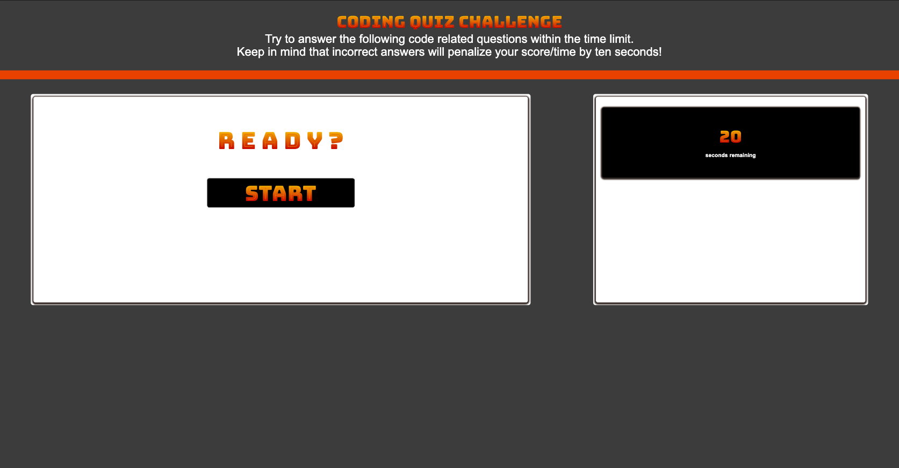

# CODING QUIZ

## Description

This project's primary objective was FUN!  Actually, it was focused on utilizing local storage, third party API's, events and traversing the DOM via JavaScript.  Nonetheless, it was a joy to make and very rewarding to see it in action.  While the code does appear a little "rough and ready", it functions and helped me to visualize areas to condense and streamline next time around.  Certain aspects of the coding process are starting to stem more from muscle memory than from having to research ad nauseam. 

## Installation

Installation is easy!  Simply copy and paste the following URL into your favorite browser:

https://argounova.github.io/code-quiz/

## Usage

Click "Start".  Answer the questions correctly for a high score.  Enter your initials at the end and see where you rank!

## Credits

Google Fonts: https://fonts.google.com/specimen/Bungee+Spice/tester

## License

N/A - Open Source